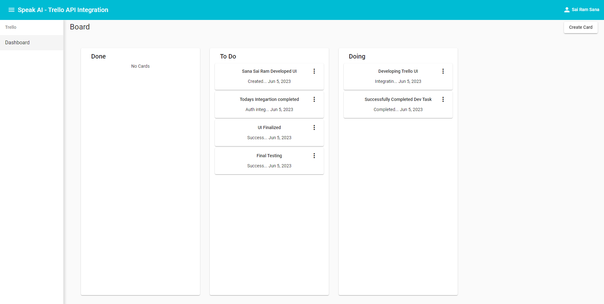

# Trello API Integration Front end

This project was generated with [Angular CLI](https://github.com/angular/angular-cli) version 12.2.12.

This project is an integration of Trello API Authentication, Card CRUD Operation, List on a Board

## Required Params and API endpoints to run the project

* constants
	* api-urls.ts

		* BASEURL = "http://localhost:5000/api/v1/" - replace base URL of the backend server

		* GETMEMBER = this.BASEURL + "member" - Get logged-in member information

		* CARDSCRUD = this.BASEURL + "card" - Card CRUD Operation 

		* LOGOUT = this.BASEURL + "authenticate/logout" - destroy session in server

		* AUTHENTICATE = this.BASEURL+ "authenticate" - Trello authentication from backend server

## Development server

Run `ng serve` for a dev server. Navigate to `http://localhost:4200/`. The app will automatically reload if you change any of the source files.

## Build

Run `ng build` to build the project. The build artifacts will be stored in the `dist/` directory.

## Further help

To get more help on the Angular CLI use `ng help` or go check out the [Angular CLI Overview and Command Reference](https://angular.io/cli) page.
